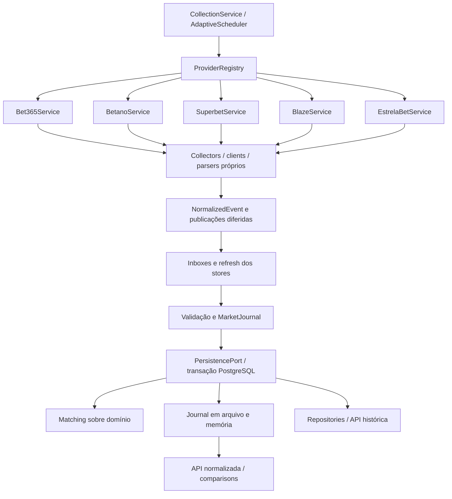

# Arquitetura atual

[Índice](../README.md#documentation) · [Regras de trabalho](../AGENTS.md)

## Limites do sistema

O backend é um processo NestJS independente, em [apps/odds-service](../apps/odds-service). O monitor lê PostgreSQL por meio do MonitorModule (REST/SSE) e não participa da coleta. [Fluxo e contratos](MONITOR.md). Não há BFF, betting engine, fila externa ou microservices. A API é GET, vinculada a 127.0.0.1; configuração em `.env`/ConfigModule.

## Módulos e dependências

| Área em src/ | Responsabilidade |
|---|---|
| `app.module.ts`, `main.ts`, `bootstrap.ts` | Composição Nest, lifecycle, middleware GET/no-store e filtro HTTP |
| `config/` | Configuração validada, caminhos, defaults de scheduler |
| `modules/bet365/` | Protocolo textual, listagem/coupon, abas, CDP e stores específicos |
| `modules/betano/` | Diretório/competições JSON, detalhes populares, browser e store |
| `modules/superbet/` | HTTP público, dicionários, listagem/detalhe JSON e store |
| `modules/blaze/` | HTTP público Betby, manifesto/shards e store |
| `modules/estrelabet/` | HTTP público Altenar, paginação, detalhe e store |
| `modules/collection/` | ProviderRegistry, CollectionService, AdaptiveScheduler, SchedulerService e CLI |
| `modules/snapshots/` | MarketJournal, cálculo de mudanças e instâncias de stores |
| `modules/matching/` | Comparação pura e acesso às listagens normalizadas |
| `modules/database/` | Prisma/pool, validação das migrations e seed |
| `modules/persistence/` | Porta de persistência, transação, repositories e API SQL |
| `modules/health/` | Agregação de saúde operacional e compatibilidade |
| `shared/` | Domínio, portas, erros, utilitários e infraestrutura CDP neutra |

AppModule importa configuração, CollectionModule, MatchingModule e HealthModule. CollectionModule importa os cinco módulos de provider e injeta a lista `ODDS_PROVIDERS` no registry. Providers usam SnapshotsModule; este alcança PersistenceModule/DatabaseModule. Não existe importação do parser de um bookmaker por outro.

As setas mostram fluxo, não que parsers compartilhem implementação. A validação ocorre também antes de publicar inbox. O scheduler só confirma sucesso após refresh e leitura do estado aceito.

## Contratos reais

[OddsProvider](../apps/odds-service/src/shared/interfaces/odds-provider.interface.ts) declara `name`, `collectEvents(options)` e `collectEventDetails(ref, options)`. `CollectOptions` inclui esports, AbortSignal e callbacks de publicação diferida; opções de browser/seleção manual preservam compatibilidade CLI.

`ProviderRuntime` acrescenta `readEvents`, `readDetail`, `refresh`, `health`, `selectDetail`, `closeCollection` e `pollCadence`. O último pertence aos loops CLI legados; não define a política adaptativa global. Implementar apenas os dois métodos conceituais de coleta não basta para registrar um provider.

[NormalizedEvent](../apps/odds-service/src/shared/domain/normalized-event.ts) estende `DetailedMatch`: provider, esport, eventId, equipes, markets, inPlay, suspended, fetchedAt; acrescenta tournament, startsAt, status, nomes raw/normalizados e provenance. `Market`/`Selection` estão em [market-model.ts](../apps/odds-service/src/shared/domain/market-model.ts). Preservam IDs, categorias, mapa, linha, flags nullable e raw; mercados também guardam grupos, round/período e, quando disponível, fetchedAt próprio.

`ProviderEventRef` contém provider/eventId/esport. Os DTOs SQL não substituem esse domínio. O objeto `canonicalEvent` da comparação não é um UUID de banco; a entidade Prisma CanonicalEvent existe somente na persistência.

## Escrita e atomicidade

1. O scheduler seleciona uma tarefa elegível, reservando provider e evento.
2. O provider navega/consulta, valida cobertura e devolve domínio mais publicações diferidas.
3. `scheduledOperation` valida identidade, esporte, timestamps e elegibilidade pré-jogo.
4. O commit publica inboxes; `refresh` reutiliza stores e validações existentes.
5. PersistenceService grava entidades, snapshots, scopes, mudanças, matching e checkpoint em transação.
6. Confirmado SQL, atualiza journal em arquivo e projeção em memória. A leitura confirma aceitação da captura.

A unidade atômica é um scope de publicação, não uma rodada global de providers. Falha SQL não publica projeção parcial. PostgreSQL e arquivo não têm transação conjunta: falha de arquivo após commit pode deixá-lo atrasado. Restart restaura PostgreSQL. Mais detalhes em [Data model](DATA_MODEL.md) e [Odds history](ODDS_HISTORY.md).

## Leitura, erros e stale

Controllers dos providers leem stores e aplicam TTL. MatchingService consulta listagens frescas do registry e compara as fontes disponíveis; não agrega automaticamente os detalhes salvos. Consultas de PersistenceController leem o histórico SQL com relações e não aplicam o mesmo TTL. Não use resultados históricos como garantia de odd vigente.

Erros de domínio/filtro HTTP ficam em `shared/errors`. Ausência/stale/indisponibilidade produzem 503 nos contratos apropriados; parâmetro inválido 400, entidade não encontrada 404, método diferente de GET 405. Logs operacionais evitam mensagens com credenciais/headers. Health informa estado observado, não prova disponibilidade atual de cada endpoint remoto.

## Startup e shutdown

Conexão/migrations/seed precedem restauração de stores e catálogo. O scheduler reconstrói agenda, mas precisa de nova listagem para obter contexto de transporte. Locks/contadores não são persistidos. Shutdown para timers, drena operações/commits, fecha transportes próprios e só depois desconecta o pool. Veja [Collection](COLLECTION.md).

## Extensão segura

Alterações de provider devem passar pelo domínio comum, sem SQL no parser. Matching continua puro. Configuração global pertence a config/collection; detalhes de transporte pertencem ao provider ou à infraestrutura neutra de browser. Não crie mapper/DTO/repository vazio apenas para simetria: Betano e Superbet mapeiam no parser atual.

## Atualização: browser persistente

BROWSER_MODE=headless/headed agora seleciona Chrome próprio em ambos os modos. O perfil técnico persiste por provider; não há cópia de perfil pessoal nem contexto incognito adicional. HEADLESS é fallback legado; CDP_URL não seleciona transporte externo nos clients atuais. Betano conserva o browser entre listagens. O scheduler continua com os mesmos locks/backoff/TTL. [Diagnóstico e limites atuais](HEADLESS_DIAGNOSTICS.md).

## Processo de produção

O Dockerfile do serviço executa tini → supervisor Bash → Xvfb + Nest compilado. Chrome Stable headed é filho do serviço, com profiles por provider no volume persistente. HOST=0.0.0.0 no container; local continua loopback. Shutdown mantém o display até a drenagem e fechamento dos browsers. [Runtime](PRODUCTION_RUNTIME.md).

## Atualização: Chrome compartilhado

O fluxo atual usa `BrowserModule`/`LocalCdpService`: CDP no Chrome pessoal existente do Mac, targets próprios reutilizados, sem fechar o browser pessoal. Superbet segue HTTP. Chrome próprio compartilhado/Xvfb é histórico, fora da DI desses providers.
