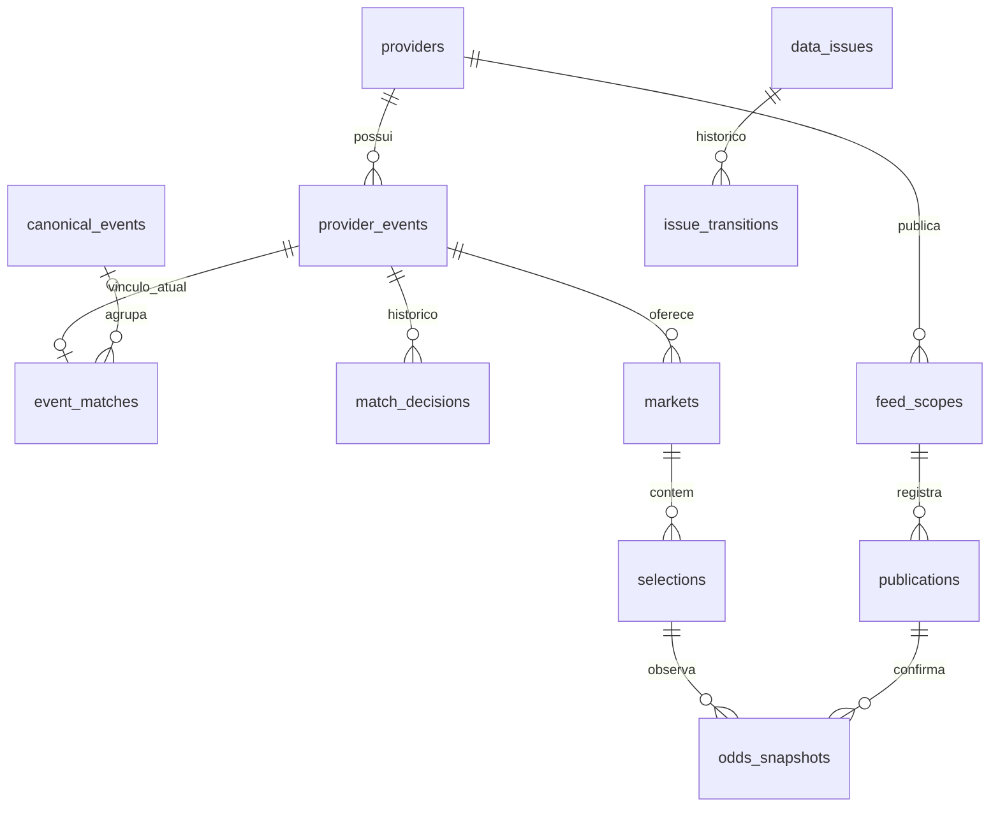

# Modelo PostgreSQL

[Índice](../README.md#documentation) · [Schema executável](../apps/odds-service/prisma/schema.prisma) · [Migration inicial](../apps/odds-service/prisma/migrations/202609150001_initial_odds/migration.sql) · [Guia de migração/importação](../apps/odds-service/docs/postgres.md)

## Convenções e fonte de verdade

Prisma 7 é o único ORM, com adapter-pg. PostgreSQL 16 local. IDs internos são UUID com gen_random_uuid(); IDs externos string. Datas usam timestamptz(3), UTC. Odds/linhas numeric(24,12), confidence numeric(6,5). FKs usam ON DELETE RESTRICT: não há cascata que apague histórico de odds. Campos JSON usam JSONB e passam pelo sanitizador.

CanonicalEvent representa o evento real compartilhado; ProviderEvent representa a oferta identificada pelo bookmaker. **event_matches é a única fonte do vínculo atual**: provider_events não possui canonical_event_id duplicado. match_decisions guarda histórico, inclusive vínculos anteriores reutilizáveis. O canônico da função de matching é um objeto de domínio; seu UUID persistente é atribuído pelo repository.

## Entidades, cardinalidade e lifecycle

Todas as tabelas têm PK `id` UUID. Nesta tabela, IDs de FK são internos, salvo quando indicado como externo.

| Tabela / modelo | Campos importantes e relações | Identidade / lifecycle |
|---|---|---|
| providers / Provider | slug, name, enabled; 1:N events/scopes/issues; created_at/updated_at | Slug unique; seed idempotente. enabled é metadado persistido, não feature flag que liga/desliga o registry em memória |
| canonical_events / CanonicalEvent | esport, tournament, team_a/b, starts_at, status, ended_at?, metadata?; 1:N matches/decisions/issues; auditoria | Criado para grupo não ambíguo; status explícito, sem inferência finished por ausência |
| provider_events / ProviderEvent | provider_id FK, provider_event_id **externo**, esport, raw/normalized_team_a/b, raw/normalized_tournament, starts_at, provider_status, in_play?, suspended?, last_seen_at, fetched_at, listed, removed_at?, raw_data; auditoria | Unique(provider_id, provider_event_id). Upsert; ausência aceita marca listed=false/removed_at, não apaga |
| event_matches / EventMatch | provider_event_id FK unique, canonical_event_id FK nullable, confidence, status, reason?, start_delta_seconds?, matched_at; auditoria | ProviderEvent 0..1 decisão atual; CanonicalEvent 0..N vínculos. Unmatched tem canônico null |
| match_decisions / MatchDecision | provider_event_id FK, canonical_event_id FK nullable, status, confidence, reason?, detected_at | ProviderEvent 1:N decisões; registra mudanças, não substitui decisão anterior |
| team_aliases / TeamAlias | esport, alias, canonical_name, evidence, created_at | Variante normalizada única por esporte, aprendida apenas de grupo não ambíguo; reutilizada no matching |
| tournament_aliases / TournamentAlias | esport, alias, canonical_name, evidence, created_at | Variante revisada do torneio, confirmada por grupo não ambíguo e reutilizada no matching |
| markets / Market | provider_event_id FK, provider_market_id externo, raw_market_id, category, name, map_number?, line?, period?, suspended?, in_play?, raw_data, first_seen_at/last_seen_at; auditoria | Unique(evento interno, mercado externo). Upsert; mercados ausentes são históricos, não deletados |
| selections / Selection | market_id FK, provider_selection_id externo, name, side?, line?, suspended?, raw_data, fetched_at; auditoria | Unique(mercado interno, seleção externa). 1:N snapshots |
| odds_snapshots / OddsSnapshot | selection_id/publication_id FKs, source_scope, odds?, line?, map_number?, suspended?, in_play?, fetched_at, created_at | Append-only por observação; unique(publication_id, selection_id, source_scope, fetched_at) |
| data_issues / DataIssue | dedupe_key, type, severity, message, details?, status, detected_at/resolved_at?; FKs opcionais provider/canonical/event/market/selection; auditoria | Dedupe key unique; open/resolved/ignored, sem apagar histórico de resolução |
| issue_transitions / IssueTransition | issue_id FK, status, at | Issue 1:N transições de estado |
| feed_scopes / FeedScope | name, provider_id FK, esport, kind, fetched_at?, events JSONB, observations JSONB | Name unique; última cobertura/baseline publicada; 1:N publications |
| publications / Publication | scope_id FK, fetched_at, hash, changes JSONB, created_at | Unique(scope_id, fetched_at); ledger da publicação e mudanças; 1:N snapshots |
| legacy_checkpoints / LegacyCheckpoint | key, payload JSONB, updated_at | Key unique; projeção de compatibilidade para restaurar stores/API |

`?` significa nullable. Campos created_at/updated_at são auditoria de entidades mutáveis; MatchDecision e IssueTransition usam detected_at/at, FeedScope usa fetched_at, sem inventar colunas de auditoria ausentes. Consulte schema para tipos e relações completas.

Enums: EventStatus scheduled/live/suspended/finished; MatchStatus matched/partial/low_confidence/manual/unmatched; IssueStatus open/resolved/ignored. Modelar um valor não significa ter workflow implementado: matching automático atual emite matched/unmatched. Tipos de issue/severity são strings extensíveis; detectores atuais se limitam a unmatched e conflito de identidade canônica.

Diagrama resumido: FKs opcionais de issues, canônico das decisões e checkpoints estão descritos na tabela.

## Índices e constraints reais

Além das PKs UUID, a migration cria:

| Tabela | Unique / índices adicionais |
|---|---|
| providers | unique slug |
| canonical_events | starts_at; status |
| provider_events | unique(provider_id, provider_event_id); (provider_id, starts_at); last_seen_at; provider_status |
| event_matches | unique provider_event_id; canonical_event_id; status |
| match_decisions | (provider_event_id, detected_at DESC) |
| markets | unique(provider_event_id, provider_market_id); (category, map_number) |
| selections | unique(market_id, provider_selection_id) |
| odds_snapshots | unique(publication_id, selection_id, source_scope, fetched_at); (selection_id, fetched_at DESC, created_at DESC) |
| data_issues | unique dedupe_key; (status, severity, detected_at DESC); provider_id; canonical_event_id; provider_event_id |
| issue_transitions | (issue_id, at DESC) |
| feed_scopes | unique name; (provider_id, kind) |
| publications | unique(scope_id, fetched_at) |
| legacy_checkpoints | unique key |

Índices unique compostos já atendem busca pelo primeiro campo: não há índice redundante separado de markets(provider_event_id) ou selections(market_id). Constraints SQL adicionais: odd null ou >1; map_number positivo no mercado; confidence 0..1 em event_matches; canônico null se e somente se status unmatched nessa tabela. Não atribua esses checks a todas as tabelas/colunas por analogia.

Trigger bloqueia UPDATE e DELETE em odds_snapshots. Operações administrativas destrutivas como TRUNCATE não são autorizadas por isso; testes usam banco descartável.

## Escrita transacional

PersistenceService orquestra repositories: catalog para upserts/observações, matching para identidade canônica e issues, read para consultas. Provider modules não conhecem Prisma. Porta em shared/interfaces mantém modelos ORM fora do domínio.

Cada publicação usa transação com advisory lock de publicação (7140365), maxWait 30s e timeout 120s. Upserts usam timestamps para não regredir campos. Persistem snapshots aceitos, scopes, ledger, matching e checkpoint juntos. Mesmo scope/timestamp/hash repetido é idempotente; conflito rejeita; publicação antiga não é backfill. Ausência em listagem válida atualiza listed/removedAt preservando status/histórico.

Depois do commit SQL, journal local e memória são atualizados. Falha SQL reverte tudo; falha posterior de arquivo pode deixar arquivo atrasado. Reinício em modo postgres restaura checkpoints/baselines do banco, sem renovar timestamps. Atomicidade é por scope, não entre todos os providers. Detalhes em [Odds history](ODDS_HISTORY.md).

## Raw e precisão

raw_data/proveniência, scopes e checkpoints são sanitizados recursivamente em [sanitize.ts](../apps/odds-service/src/modules/persistence/sanitize.ts). Removem dados sensíveis de objetos/URLs e conteúdo estruturado reconhecido. Não forneça ao pipeline payload de autenticação desnecessário nem suponha que regex detecta todo segredo possível. Preserve apenas evidência de dados de odds.

Numeric evita float SQL para odds; entrada normalizada continua number conforme contrato existente, convertida para decimal na gravação. Não promete recuperar precisão que uma fonte já perdeu antes do parser. Novas rotas Prisma serializam Decimal como string, sem mudar rotas normalizadas numéricas.

## Current odds e consultas

Estratégia A: último snapshot por seleção, ordenado por fetched_at DESC e created_at DESC. Não existe current_odds/current_snapshot_id redundante. Repositories carregam relações em lote, sem loop manual de uma consulta por seleção.

`/events` carrega canônico → event_matches → provider_event/provider → markets/selections/último snapshot. `/provider-events` inclui unmatched/ausentes. `/issues` inclui transições. São consultas históricas, sem filtragem automática de TTL/mercado removido. Limites 50/100/200 e paginação parcial estão em [Operations](OPERATIONS.md).

## Migrations e desenvolvimento

Migration atual: `202609150001_initial_odds`, mais migration_lock.toml. `db:migrate` aplica; `db:status` verifica; startup valida nomes/checksums/conclusão, sem aplicar DDL. Seed idempotente insere/atualiza nomes dos cinco providers sem apagar enabled.

Para mudar schema: edite schema.prisma, crie **nova** migration em banco de desenvolvimento com `npx prisma migrate dev --name descricao`, revise SQL, execute db:generate/build/typecheck/test:db e versione schema/migration. Esse comando pode pedir reset se houver drift: não aceite reset de banco útil; diagnostique primeiro. Não edite migration já aplicada nem use db push como entrega.

Não existe purge/particionamento/backup automatizado. Journal arquivo e checkpoints são legado deliberado; importação opcional de capturas está no guia PostgreSQL. Novo slug não exige mudança de schema, mas coletor requer integração TypeScript/DI/config/seed.
