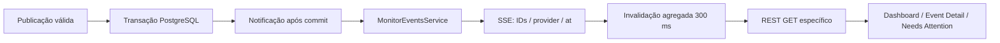

# Odds Monitor: REST + SSE

O frontend interno `apps/odds-monitor` lê o NestJS diretamente. Não há BFF, WebSocket, acesso do frontend ao banco, preços calculados ou endpoints de escrita. O backend continua independente do monitor.

## Executar

Backend: seguir o [README](../README.md) para PostgreSQL, migrations e seed. Usar `PERSISTENCE_MODE=postgres`; em modo arquivo as consultas do monitor retornam 503, sem fallback fictício. Um banco recém-criado mostra listas vazias.

```sh
cd apps/odds-service
# .env: ODDS_MONITOR_ORIGIN=http://localhost:3000
npm start
```

Em outro terminal:

```sh
cd apps/odds-monitor
npm ci
# Se ainda não existir .env:
cp .env.example .env
# VITE_ODDS_SERVICE_URL=http://localhost:3650
npm run dev
```

Origin é exata, incluindo esquema/host/porta, sem barra final. `localhost` e `127.0.0.1` são origins diferentes. `ODDS_MONITOR_ORIGIN` aceita uma lista separada por vírgulas, validada no ConfigModule; não aceita `*`. Sem configuração não se habilita acesso cross-origin. Preflight CORS é permitido; operações de domínio continuam somente GET. Vite injeta `VITE_ODDS_SERVICE_URL` no build: não colocar segredos nessa variável. Em produção usar o domínio específico do monitor e acesso interno controlado; esta tarefa não introduz autenticação.

## Rotas e contratos

| GET | Resposta / filtros |
| --- | --- |
| `/monitor/overview` | `generatedAt`, `health {status,events,matched,partial,unmatched,issues}`, `providers[]` |
| `/monitor/providers` | Array dinâmico `{id,name,enabled,active,status,statusReason,eventCount,lastUpdatedAt,stale}` |
| `/monitor/events` | `{items:EventRow[],pagination:{page,limit,total,pages}}` |
| `/monitor/events/:id` | EventRow + providers com mercados e `markets[]` prioritários |
| `/monitor/events/:id/raw` | `{eventId,raw:[{provider,rawData,markets}]}` sanitizado; carregamento sob demanda |
| `/monitor/events/:id/odds-history` | `{eventId,series:[{provider,market:{id,category,mapNumber},selection,selectionId,points:[{odds,fetchedAt,suspended,inPlay}]}],truncated}` |
| `/monitor/issues` | `{items:[{id,type,severity,status,eventId,provider,title,message,detectedAt}]}` |
| `/monitor/stream` | `text/event-stream`, invalidações pequenas |

`EventRow`:

```typescript
{
  id: string; canonicalId: string | null;
  esport: string; tournament: string; teamA: string; teamB: string; startsAt: string;
  matching: {status: string; confidence: number; providerCount: number; expectedProviderCount: number};
  providers: [{id: string; provider: string; active: boolean; statusReason: string;
    providerEventId: string;
    rawTeamA: string; rawTeamB: string; rawTournament: string;
    startsAt: string; lastUpdatedAt: string; status: string;
    matchWinner: {teamA: number | null; teamB: number | null; status: string}; issues: Issue[]}];
  issues: Issue[];
}
```

- `id` normalmente é o UUID canônico. Um evento **unmatched** usa seu UUID interno de `provider_events`, com `canonicalId:null`. Isso permite inspecionar eventos sem inventar um canônico. Ambos os IDs funcionam em detail/history/raw e SSE. O ID externo permanece em `providerEventId` e não é globalmente único.
- Categorias usam os nomes reais do domínio: `match_winner`, `map_winner`. A leitura de mercados prioritários inclui mapas 1–3. Outros mapas/mercados não foram removidos da persistência ou dos parsers. History aceita outros mercados explicitamente.
- Snapshot atual é o último por seleção, ordenado por `fetchedAt` e `createdAt`. Mercados/seleções atuais são limitados à união da cobertura dos últimos batches de cada scope; registros históricos removidos não reaparecem apenas porque existem nas tabelas. Entre observações do mesmo mercado prevalece a mais recente para a composição das seleções.
- `status` de provider combina configuração/runtime e frescor persistido; não significa que uma coleta foi executada ao abrir o monitor. `lastUpdatedAt` é timestamp da observação, não o horário do GET. Cada mercado/seleção também expõe seu estado, evitando que uma listagem recente esconda um detalhe antigo.
- `stale` usa o TTL existente (`MAX_AGE_SECONDS`, default 600). Odds antigas continuam identificadas, nunca são transformadas em dados atuais fictícios. Suspensão, in-play e odd null são preservados.
- Matching usa vínculos/decisões existentes. A cobertura do monitor é calculada por esporte contra providers habilitados e ativos no runtime; um provider ativo continua esperado quando fica stale ou unavailable, para que a falha permaneça visível. `partial` representa ao menos dois providers associados, mas menos que `expectedProviderCount`; com menos de dois ativos o status é `not_applicable`, fica fora de matched/partial/unmatched e não aparece em Needs attention. No Railway, onde Bet365/Betano são intencionalmente excluídos sem `local-cdp`, os três providers HTTP produzem `expectedProviderCount:3`; snapshots antigos dos providers desabilitados continuam visíveis como `Disabled in this runtime`, mas não entram no denominador. Isso não é quorum de pricing. Confidence é o mínimo das decisões associadas, não uma probabilidade de vitória.
- A tabela reúne eventos ainda `listed`; detail/history podem recuperar representações removidas. Desaparecimento não significa evento finalizado. Não se exclui evento apenas porque seu startsAt passou.

### Filtros

Events: `search` (times/campeonato, até 200 caracteres), `esport=cs2|lol|valorant`, `status=matched|partial|unmatched|low_confidence|manual`, `start=today|24h|7d`, `provider=slug`, `attentionOnly=true|false`, `page>=1`, `limit=1..100` (default 50). `today` usa America/Sao_Paulo; 24h/7d usam janela futura a partir do relógio do servidor. Necessidade de atenção inclui issues abertas ou status diferente de matched. Providers desconhecidos retornam resultado vazio.

Issues: `severity`, `type`, `provider`, `eventId`, `status=open|resolved|ignored` (default open), `limit=1..500` (default 100). Somente issues persistidas; nenhuma criação de outlier/pricing foi adicionada. Drawer carrega até 500, informando o limite.

History: `provider`, `market` (categoria, UUID interno ou ID externo), `selection` (UUID interno ou ID externo), `from`, `to` (ISO com timezone). Resultado cronológico, limitado a 2.000 pontos por resposta; `truncated=true` sinaliza a necessidade de restringir seleção/período. Não inventa pontos nem elimina observações repetidas. `series` permite uma consulta não específica sem misturar linhas de seleções diferentes. O frontend solicita uma seleção por vez.

IDs malformados/filtros inválidos: 400. Evento inexistente: 404. PostgreSQL indisponível: 503 sanitizado. Controller não executa SQL. MonitorRepository usa consultas parametrizadas, agregações/batches e includes; não dispara uma consulta por evento/seleção. Paginação e contagem usam transação RepeatableRead; overview/detail são projeções eventualmente consistentes entre suas consultas, não um snapshot global de todos os GETs.

## Fluxo de atualização



`PersistenceNotifications` observa as mudanças já calculadas por `marketChanges`. Não duplica matching, não altera o journal e não emite uma publicação revertida, repetida ou descartada como antiga. Com monitor desconectado a coleta continua normalmente.

| Domínio/observação | SSE |
| --- | --- |
| OddsChanged | `odds.changed` |
| MarketAdded/Removed/Suspended/Reopened | `market.updated` |
| EventAdded/Removed | `event.added` / `event.removed` |
| Publicação válida | `provider.updated`, `event.updated` |
| Vínculo/status/confidence de matching mudou | `matching.updated` |
| Issue passou a open/resolved | `issue.created` / `issue.resolved` |
| Provider passou a stale | `provider.stale` |
| Conexão/reconexão | `ready` (refazer estado REST) |
| Falha na observação de metadados | `resync` |
| A cada 25s | `heartbeat` |

Exemplo: `event: odds.changed` com `data: {eventId,provider,marketId,selectionId,at}`. IDs de mercado/seleção nessa mensagem são externos; `eventId` é resolvido para o ID navegável do monitor. `event.updated` de publicação contém o ID navegável de cada evento observado; notificações sem lista de IDs podem usar invalidação por provider. Nenhuma mensagem contém valores brutos, headers, before/after, tabelas, mercados ou histórico completos.

Matching/issues são comparados a partir dos metadados persistidos após cada publicação. O heartbeat também reconcilia metadados, detectando alterações por outros caminhos em até 25s. Transições intermediárias que se encerraram entre leituras não têm garantia de entrega: SSE é invalidação, e o histórico persistido/GET é a verdade.

Um único timer e subscription de publicação por serviço; assinantes desconectados são removidos e o timer para quando o último sai. O frontend usa EventSource nativo e remove listeners/fecha conexão no unmount. Não depende de `networkidle`, não há WebSocket. Reconexão automática + `ready` repõe atualizações perdidas; não existe replay durável via Last-Event-ID. **Uma instância escritora** é o modo suportado. Multi-réplica precisará estratégia compartilhada; o poll de metadados não substitui um bus distribuído para odds.

Frontend agrega invalidações por 300 ms: provider altera overview/tabela; issue altera overview/drawer; odds/market só altera detail/history/raw quando o evento aberto corresponde (e invalida a tabela); matching também revalida o detalhe aberto para acomodar mudança de identidade. Heartbeat não causa GET no frontend. SYNC somente refaz as leituras visíveis: nunca aciona scheduler ou coleta externa. SSE desconectado mostra indicador; GET/Sync continuam disponíveis.

## Telas e remoção de simulações

Mantidos tema, header, cards, filtros, tabelas, detalhe, histórico e drawer. Removidos `src/data/mockData.ts`, tipos antigos fixos, modal de inspeção com ações fictícias e modal de referências. Não há fallback para mocks. Dados de teste ficam somente em `tests/fixtures/monitor.json`, capturados da API sobre dados reais sanitizados.

Sem Pinnacle inexistente, Max Arbitrage, benchmark/consensus/delta/best price, Provider Quorum fictício, percentuais de barras inventados, latência/versão/região fake, usuário fake, purge/blacklist/acknowledge/resolve simulados. Loading/empty/error são explícitos. Nenhuma resolução de issue é fingida pelo frontend.

## Testar

```sh
cd apps/odds-service
npm run build
npm run typecheck
npm run format:check
npm test
# Somente banco descartável *_test, a suíte TRUNCA tabelas:
TEST_DATABASE_URL=... npm run test:db

cd ../odds-monitor
npm ci
npm run build
npm run typecheck
npm run lint
npm test
```

Testes normais: zero bookmakers/rede externa/Postgres. Backend testa filtros, rotas, CORS, conexão SSE, heartbeat, múltiplos assinantes, cleanup, matching/issues/stale. Suíte SQL testa projeção, filtros, histórico, sanitização, mercado removido, provider dinâmico e notificações somente após commit. Frontend testa REST, invalidação seletiva, loading/empty/error, providers, filtros, drawer, refresh, desconexão/reconexão e cleanup.

E2E opcional `npm run test:monitor:e2e` no backend: PostgreSQL com **cópia isolada** de dados reais contendo detalhe CS2 EstrelaBet e nome terminando `_validation`; configurar `MONITOR_E2E_DATABASE_URL`. O script inicia Nest em 3199, desabilita coleta/inbox, abre Chrome próprio apenas para localhost e publica uma alteração controlada nessa cópia. Nunca apontar ao banco utilizado pela coleta. O script não cria a cópia nem inicia Vite. Exemplo do frontend para esse teste:

```sh
cd apps/odds-monitor
VITE_ODDS_SERVICE_URL=http://127.0.0.1:3199 npm run dev -- --port=3300 --host=127.0.0.1
# Outro terminal, apps/odds-service:
MONITOR_E2E_FRONTEND_URL=http://127.0.0.1:3300 MONITOR_E2E_DATABASE_URL=... npm run test:monitor:e2e
```

O browser headless do E2E navega **somente a UI local**, não é uma estratégia de acesso a bookmakers. Bet365/Betano continuam exclusivamente local-cdp.

## Validação observada — 2026-09-15

PostgreSQL de validação com 169 grupos (7 partial, 162 unmatched), 5 providers cadastrados e 165 issues. A leitura de dados antigos mostrou stale/disabled, sem simular saúde. Teste Chrome Stable 152.0.7977.83 sobre cópia `odds_monitor_validation`: Team Brute × G2 Ares, mercados match/map 1/map 2, histórico e raw reais. Alterações **controladas, não coletas de bookmaker** 1.5264 → 1.5394 → 1.5524 via PersistenceService disparou SSE e novo GET; DOM atualizou preservando marcador em window (sem reload), com zero page errors. Sync e drawer também passaram. Evidências locais ignoradas em `apps/odds-service/evidence/monitor/` (`e2e.json`, screenshots).

Limitações: histórico paginado por filtro/limite, não por cursor; SSE sem replay durável/multi-réplica; metadados de issues/matching são varridos para detectar mudanças e deverão ser incrementais se o volume crescer; métricas de pricing/outlier não foram criadas; dados reais existentes podem estar stale. O harness de um teste legado de SIGTERM foi corrigido para anunciar readiness somente após registrar o handler; o runtime não foi alterado.

Resultado final: backend **149 aprovados / 153 descobertos, 4 browser opcionais pulados**; PostgreSQL **27/27**; frontend **5/5**; builds, typechecks e format:check/lint aprovados. E2E repetido com sucesso, sempre encerrando browser e Nest ao terminar.

## Arquivos de implementação

```text
apps/odds-service/src/
  modules/monitor/
    monitor.module.ts
    monitor.controller.ts
    monitor.service.ts
    monitor-events.service.ts
    dto/monitor.dto.ts
    tests/monitor.test.ts
    tests/monitor.e2e.ts
  modules/persistence/
    persistence-notifications.ts
    repositories/monitor.repository.ts
    persistence.service.ts                 # aviso somente após commit
    persistence.module.ts
    tests/postgres.integration.ts
  app.module.ts
  bootstrap.ts                            # CORS
  config/configuration.ts
apps/odds-monitor/
  src/lib/api/{client,monitor,types,use-resource}.ts
  src/lib/sse/monitor-stream.ts
  src/App.tsx
  src/components/{Header,Footer,DashboardView,EventDetailView,NeedsAttentionDrawer,DataState}.tsx
  tests/{stream.test.ts,ui.test.tsx,fixtures/monitor.json}
  .env.example
  README.md
  package.json / package-lock.json / tsconfig.json
```

Ajustado apenas o harness do teste `collection/tests/runtime.test.ts` para readiness determinística. Nenhum parser, regra de matching, schema/migration de PostgreSQL, scheduler ou transporte de bookmaker foi alterado. Arquivos de Railway/proxy que apareceram paralelamente no workspace foram preservados; essa infraestrutura não faz parte da validação local descrita aqui.
